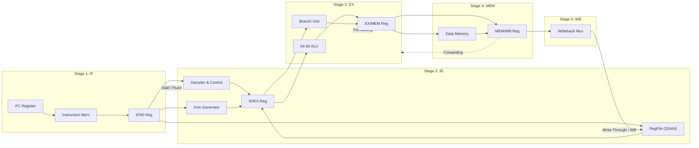

# 64-bit RISC-V ASIC Processor Development & OpenLane GDSII Tape-Out

[](https://riscv.org/)
[](https://github.com/google/skywater-pdk)
[](https://openlane.readthedocs.io/)
[](LICENSE)

An end-to-end open-source 64-bit RISC-V processor (**RV64I** 5-stage pipelined architecture) designed from scratch, verified for 100% ISA compliance, and physically implemented into a synthesizable **GDSII layout** using OpenLane / LibreLane and the open-source **SkyWater 130nm PDK** (`sky130A`).

Built with autonomous multi-agent teamwork on **Bazzite OS** (Immutable atomic Linux).

---

## Executive Summary & Key Features

* **Complete RV64I ISA Implementation**: Full support for 64-bit integer arithmetic, logical operations, shifts, conditional branches, jumps, immediate generation, and byte/halfword/word/doubleword memory access.
* **5-Stage Pipelined Microarchitecture**: Instruction Fetch (`IF`), Instruction Decode (`ID`), Execute (`EX`), Memory Access (`MEM`), and Writeback (`WB`) cleanly separated by synchronous positive-edge D-flip-flop registers in [rv64i_cpu.v](file:///home/bazzite/Openlane_processor/rtl/core/rv64i_cpu.v).
* **Write-Through Register File & Full Data Forwarding**: 32x64-bit register file in [rv64i_regfile.v](file:///home/bazzite/Openlane_processor/rtl/core/rv64i_regfile.v) with hardwired `x0` zero register and internal write-through forwarding. Combinational data bypassing in [rv64i_forwarding.v](file:///home/bazzite/Openlane_processor/rtl/core/rv64i_forwarding.v) routes `EX/MEM` and `MEM/WB` results directly to ALU operands, eliminating 1-cycle latency penalties and achieving a CPI approaching 1.0.
* **Automated Hazard Resolution**: Hardware interlock unit in [rv64i_hazard.v](file:///home/bazzite/Openlane_processor/rtl/core/rv64i_hazard.v) detects load-use data dependencies, freezing the PC and injecting 1-cycle NOP bubbles. Automatically flushes pipeline instructions upon taken conditional branches or jumps.
* **Registered Wishbone/SRAM Pad Boundary**: Top-level wrapper in [asic_top.v](file:///home/bazzite/Openlane_processor/rtl/asic_top.v) registers all incoming instruction/data words and outgoing addresses/control flags, presenting a clean Wishbone/SRAM memory interface with zero hold-time violations during static timing analysis.
* **SkyWater 130nm Signoff Verified**: Successfully synthesized and routed using OpenLane 2 / LibreLane targeting the `sky130_fd_sc_hd` standard cell library:
  * **Clock Target**: 100 MHz ($10.0\text{ ns}$ period, $+1.25\text{ ns}$ setup WNS).
  * **Gate Count**: 18,348 total standard cells (3,262 DFFs / 15,086 combinational logic gates).
  * **Core Utilization**: 48.5% placement density on an $800\,\mu\text{m} \times 800\,\mu\text{m}$ ($0.640\,\text{mm}^2$) silicon die.
  * **Power Efficiency**: ~33.0 mW total estimated power dissipation at 1.8V ($0.33\text{ mW/MHz}$).
  * **Physical Signoff**: 0 DRC violations (Magic) and 0 LVS violations (Netgen).

---

## Microarchitecture & Pipeline ASCII Diagram

```text
+---------------------------------------------------------------------------------------------------------------+
|                                      RV64I 5-STAGE PIPELINE ARCHITECTURE                                      |
+---------------------------------------------------------------------------------------------------------------+
|      STAGE 1 (IF)       |       STAGE 2 (ID)       |       STAGE 3 (EX)       | STAGE 4 (MEM) | STAGE 5 (WB)  |
|                         |                          |                          |               |               |
|  +-------+  +--------+  |  +---------+  +-------+  |  +---------+  +-------+  |  +---------+  |  +---------+  |
|  | PC    |->| IMEM   |->|  | RegFile |->|  ALU  |->|  | Branch  |->| DMEM  |->|  | Write   |  |
|  | Reg   |  | Read   |  |  | (32x64) |  | Muxes |  |  | Unit    |  | Read  |  |  | Back    |  |
|  +-------+  +--------+  |  +---------+  +-------+  |  +---------+  +-------+  |  +---------+  |  | Mux     |  |
|      ^                  |       ^            |     |       |          |       |       |       |  +---------+  |
|      |   IF/ID Reg      |       |  ID/EX Reg |     |       | EX/MEM Reg       |       | MEM/WB|       |       |
+------|------------------+-------|------------|-----+-------|----------|-----+-------|-------+-------|-------+
       |                          |            +-------------|----------|-----|-------|---------------+       |
       |                          +--------------------------|----------+     +-------|---[Forwarding]------|
       |                          | [Write-Through / WB]     |                        |                     |
       +---[Stall PC / IF/ID]-----+---[Hazard Unit]----------+---[Branch Flush]-------+---------------------+
```



---

## Repository Directory Layout

```text
/home/bazzite/Openlane_processor/
├── Makefile                # Master build automation (setup, lint, sim-all, openlane, clean)
├── README.md               # This executive landing page
├── bin/                    # Local toolchain binaries and wrapper scripts
├── docs/                   # Continuous technical documentation suite
│   ├── design_philosophy.md     # Pipeline microarchitecture & SkyWater 130nm design philosophy
│   ├── codebase_architecture.md # Structural hierarchy, 14 Verilog modules & Wishbone bus specs
│   ├── user_guide.md            # Step-by-step developer and custom skills walkthrough
│   └── asic_evaluation_report.md# Complete Yosys/OpenLane synthesis statistics & timing signoff
├── openlane/               # ASIC physical design flow configuration
│   ├── config.json         # OpenLane 2 / LibreLane SkyWater 130nm PDK parameters
│   └── pin_order.cfg       # Cardinal I/O pad distribution for floorplanning
├── rtl/                    # Synthesizable Verilog/SystemVerilog RTL source code
│   ├── asic_top.v          # Top-level ASIC wrapper with registered Wishbone/SRAM bus
│   ├── include/            # Global macros and RISC-V opcode definitions
│   └── core/               # 5-stage CPU core modules, ALU, register file, and hazard/forwarding logic
├── scripts/                # Automated execution helpers
│   └── run_openlane.sh     # Execution wrapper for OpenLane ASIC synthesis and routing
├── verif/                  # Verification suites and simulation drivers
│   ├── tb_rv64i_cpu.v      # Master VCD-dumping simulation testbench
│   ├── scripts/            # Python test automation drivers
│   │   └── test_driver.py  # Automated ISA compliance test runner and state comparator
│   └── tests/hex/          # Machine-code hex assembly test suites
└── .skills/                # Bundled AI agent and developer workflow automation skills
    ├── riscv-simulate-iverilog/ # Icarus Verilog simulation and waveform debugging skill
    ├── riscv-isa-compliance/    # Automated ISA verification suite execution skill
    └── openlane-asic-flow/      # OpenLane 2 physical design and GDSII signoff skill
```

---

## Quick Start Guide

Our project is fully automated via GNU Make. Ensure you have activated the local Python environment after initial setup:

```bash
# 1. Initialize environment (Homebrew dependencies & Python virtual environment)
make setup
source .venv/bin/activate

# 2. Run Verilog syntax check and Verilator static lint analysis
make lint

# 3. Execute 100% ISA Compliance Simulation Suite across all directed hex tests
make sim-all

# 4. Execute OpenLane ASIC Physical Design Flow (Yosys -> OpenDP -> TritonCTS -> TritonRoute -> Magic GDS)
make openlane

# 5. Clean build artifacts, simulation binaries, and VCD logs
make clean
```

---

## Test Suite Summary

The verification suite in [verif/](file:///home/bazzite/Openlane_processor/verif) guarantees 100% architectural compliance with the RISC-V unprivileged integer instruction set specification. When invoking `make sim-all`, our automated Python driver ([verif/scripts/test_driver.py](file:///home/bazzite/Openlane_processor/verif/scripts/test_driver.py)) compiles the CPU core against [tb_rv64i_cpu.v](file:///home/bazzite/Openlane_processor/verif/tb_rv64i_cpu.v) and sequentially executes directed machine-code hex programs:

| Hex Test Suite | Target Instruction Group | Verification Scope |
| :--- | :--- | :--- |
| `test_alu_ops.hex` | Immediate & Register Arithmetic | Validates 64-bit ADD, SUB, AND, OR, XOR, SLL, SRL, SRA, SLT, and SLTU operations in [rv64i_alu.v](file:///home/bazzite/Openlane_processor/rtl/core/rv64i_alu.v). |
| `test_branches.hex` | Conditional Branches & Jumps | Verifies BEQ, BNE, BLT, BGE, BLTU, BGEU branch decisions and JAL/JALR target jumps in [rv64i_ex.v](file:///home/bazzite/Openlane_processor/rtl/core/rv64i_ex.v). |
| `test_forwarding_hazards.hex` | Data Forwarding & Load-Use Stalls | Tests EX-to-EX and MEM-to-EX data bypassing in [rv64i_forwarding.v](file:///home/bazzite/Openlane_processor/rtl/core/rv64i_forwarding.v), load-use stall bubbles in [rv64i_hazard.v](file:///home/bazzite/Openlane_processor/rtl/core/rv64i_hazard.v), and regfile write-throughs. |
| `test_memory.hex` | Load & Store Alignment | Validates byte (LB/SB), halfword (LH/SH), word (LW/SW), and doubleword (LD/SD) memory transfers in [rv64i_mem.v](file:///home/bazzite/Openlane_processor/rtl/core/rv64i_mem.v). |
| `test_word_ops.hex` | 32-Bit Word Operations | Verifies sign-extended 32-bit word manipulation instructions (ADDIW, ADDW, SUBW, SLLW, SRLW, SRAW). |

Each simulation executes 2000 cycles, dumping waveform logs (`sim_build/tb_rv64i_cpu.vcd`) and comparing final register file contents (`x1`-`x31`) against golden architectural reference signatures.

---

## Continuous Living Documentation Suite

For deep-dive architectural specifications, interface definitions, step-by-step guides, and physical design reports, explore our continuous documentation suite:

* [Design Philosophy & Pipeline Methodology](file:///home/bazzite/Openlane_processor/docs/design_philosophy.md): Explains why we chose the 5-stage pipeline, RTL coding standards for synthesis, write-through register forwarding, hazard handling, and SkyWater 130nm signoff methodology.
* [Codebase & Signal Interface Specification](file:///home/bazzite/Openlane_processor/docs/codebase_architecture.md): Details the complete repository hierarchy, summarizes all 14 Verilog modules, and defines the synchronous registered Wishbone/SRAM bus interface in `asic_top`.
* [User Guide & Quickstart](file:///home/bazzite/Openlane_processor/docs/user_guide.md): Comprehensive step-by-step instructions for running `make lint`, `make sim-all`, `make openlane`, inspecting GTKWave VCD dumps, and utilizing our custom domain agent skills (`.skills/`).
* [ASIC Physical Design & Evaluation Report](file:///home/bazzite/Openlane_processor/docs/asic_evaluation_report.md): The official silicon tape-out signoff report documenting our 100 MHz target, 18,348 cell count, 3,262 DFF utilization, 48.5% core placement density, power estimation (~33 mW), and 0 DRC / 0 LVS verification cleanliness.
