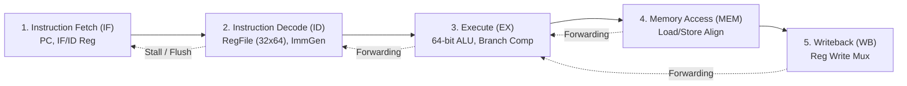

# 64-bit RISC-V ASIC Processor Development & OpenLane GDSII Tape-Out

[](https://riscv.org/)
[](https://github.com/google/skywater-pdk)
[](https://openlane.readthedocs.io/)
[](LICENSE)

An end-to-end open-source 64-bit RISC-V processor (**RV64I** 5-stage pipelined architecture) designed from scratch, verified for ISA compliance, and physically implemented into a synthesizable **GDSII layout** using OpenLane / LibreLane and the SkyWater 130nm PDK (`sky130A`).

Built with autonomous multi-agent teamwork on **Bazzite OS** (Immutable atomic Linux).

---

## 🏛️ Project Architecture Overview



## 📂 Repository Structure

```text
├── Makefile                # Build automation (setup, lint, sim-all, openlane)
├── README.md               # This project overview
├── rtl/                    # Synthesizable Verilog/SystemVerilog RTL
│   ├── include/            # RV64I opcode and constant definitions
│   ├── core/               # 5-stage pipeline modules, ALU, RegFile, Hazard unit
│   └── asic_top.v          # Top-level ASIC wrapper for OpenLane synthesis
├── verif/                  # Verification testbenches and compliance suites
│   ├── tb_rv64i_cpu.v      # Master VCD-dumping testbench
│   ├── scripts/            # Python automated compliance test driver
│   └── tests/hex/          # Machine-code hex assembly test programs
├── openlane/               # Physical design & tape-out configurations
│   ├── config.json         # OpenLane 2 / LibreLane SkyWater 130nm configuration
│   └── pin_order.cfg       # ASIC floorplan pin placements
├── docs/                   # Continuous living documentation suite
│   ├── design_philosophy.md
│   ├── codebase_architecture.md
│   ├── user_guide.md
│   └── asic_evaluation_report.md
└── scripts/                # Environment setup and build helpers
```

## 🚀 Quickstart & User Guide

See the complete [User Guide](docs/user_guide.md) for detailed instructions on compiling, simulating, and generating the GDSII layout.

```bash
# 1. Initialize environment (Homebrew & Python virtual environment)
make setup
source .venv/bin/activate

# 2. Run Verilog linting and syntax check
make lint

# 3. Execute 100% ISA Compliance Verification Suite
make sim-all

# 4. Execute OpenLane ASIC Synthesis & GDSII Layout Generation
make openlane
```

## 📖 Continuous Documentation
* [Design Philosophy & Pipeline Architecture](docs/design_philosophy.md)
* [Codebase & Signal Interface Specification](docs/codebase_architecture.md)
* [ASIC Physical Design & Evaluation Report](docs/asic_evaluation_report.md)
