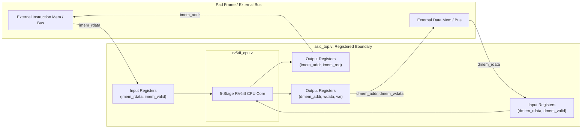

[<- Back to Technical Reference](TECHNICAL_REFERENCE.md)

# Codebase & Signal Interface Specification

This document provides the complete structural hierarchy, repository layout, signal interface specifications, and module descriptions for the 64-bit RISC-V processor ([RV64I](file:///home/bazzite/Antigravity_RISCV_64bit_Processor/rtl/include/rv64i_types.vh)).

---

## 1. Complete Repository Directory Hierarchy

The project repository is structured into distinct functional domains: RTL design, verification, physical design, scripts, and documentation:

```text
/home/bazzite/Antigravity_RISCV_64bit_Processor/
├── Makefile                     # Root build automation (setup, lint, sim-all, openlane, clean)
├── README.md                    # Project landing page and executive summary
├── bin/                         # Executable tools and locally wrapped EDA scripts
├── docs/                        # Continuous technical documentation suite
│   ├── design_philosophy.md     # Architectural trade-offs and 5-stage pipeline methodology
│   ├── codebase_architecture.md # This document: hierarchy, signal specs, and 14 Verilog modules
│   ├── user_guide.md            # Quickstart guide and Makefile command walkthrough
│   └── asic_evaluation_report.md# SkyWater 130nm synthesis, area, and timing signoff report
├── openlane/                    # Physical design and ASIC tape-out configurations
│   ├── config.json              # OpenLane 2 / LibreLane SkyWater 130nm PDK configuration
│   └── pin_order.cfg            # Top-level I/O pin placement distribution for floorplanning
├── rtl/                         # Synthesizable Verilog/SystemVerilog RTL source code
│   ├── asic_top.v               # Top-level ASIC wrapper with Wishbone/SRAM registered I/O
│   ├── include/                 # Shared header files
│   │   └── rv64i_types.vh       # Global opcode, ALU operation, and instruction formatting macros
│   └── core/                    # 5-stage CPU core modules, regfile, ALU, and hazard/forwarding units
├── scripts/                     # Automated build, lint, and synthesis driver scripts
│   └── run_openlane.sh          # Execution script for OpenLane ASIC physical design flow
└── verif/                       # Verification testbenches and ISA compliance suites
    ├── tb_rv64i_cpu.v           # Master simulation testbench with VCD waveform dumping
    ├── scripts/                 # Test execution drivers
    │   └── test_driver.py       # Python automated compliance test execution runner
    └── tests/hex/               # Machine-code hex assembly test programs for simulation
```

---

## 2. Complete Summary of 14 Verilog Modules

Our RTL and verification codebase is partitioned into exactly 14 modular Verilog files, separating pipeline stages, arithmetic units, control logic, hazard handling, and verification drivers:

| # | Module Name | File Path | Type | Primary Architectural Description |
| :--- | :--- | :--- | :--- | :--- |
| 1 | `asic_top` | [asic_top.v](file:///home/bazzite/Antigravity_RISCV_64bit_Processor/rtl/asic_top.v) | RTL (Top) | Synthesizable ASIC wrapper isolating internal CPU paths with synchronous registered Wishbone/SRAM I/O busses. |
| 2 | `rv64i_cpu` | [rv64i_cpu.v](file:///home/bazzite/Antigravity_RISCV_64bit_Processor/rtl/core/rv64i_cpu.v) | RTL (Core) | Top-level CPU wrapper interconnecting all 5 pipeline stages, register file, forwarding unit, and hazard controller. |
| 3 | `rv64i_if` | [rv64i_if.v](file:///home/bazzite/Antigravity_RISCV_64bit_Processor/rtl/core/rv64i_if.v) | RTL (Stage 1) | Instruction Fetch stage: contains the 64-bit Program Counter (`PC`), PC+4 adder, and branch/jump target selection muxes. |
| 4 | `rv64i_id` | [rv64i_id.v](file:///home/bazzite/Antigravity_RISCV_64bit_Processor/rtl/core/rv64i_id.v) | RTL (Stage 2) | Instruction Decode stage: decodes opcodes, extracts register operands, and generates immediate values. |
| 5 | `rv64i_regfile` | [rv64i_regfile.v](file:///home/bazzite/Antigravity_RISCV_64bit_Processor/rtl/core/rv64i_regfile.v) | RTL (Sub-stage)| 32x64-bit general-purpose register file with hardwired `x0` zero register and internal write-through forwarding. |
| 6 | `rv64i_imm_gen` | [rv64i_imm_gen.v](file:///home/bazzite/Antigravity_RISCV_64bit_Processor/rtl/core/rv64i_imm_gen.v) | RTL (Sub-stage)| Immediate generator sign-extending immediate bit fields for RV64I I-, S-, B-, U-, and J-type instruction formats. |
| 7 | `rv64i_control` | [rv64i_control.v](file:///home/bazzite/Antigravity_RISCV_64bit_Processor/rtl/core/rv64i_control.v) | RTL (Sub-stage)| Main control and ALU decoder generating pipeline control flags (`reg_write`, `mem_read`, `alu_op`, etc.). |
| 8 | `rv64i_ex` | [rv64i_ex.v](file:///home/bazzite/Antigravity_RISCV_64bit_Processor/rtl/core/rv64i_ex.v) | RTL (Stage 3) | Execute stage: operand forwarding multiplexers, branch condition evaluation, and jump target calculation. |
| 9 | `rv64i_alu` | [rv64i_alu.v](file:///home/bazzite/Antigravity_RISCV_64bit_Processor/rtl/core/rv64i_alu.v) | RTL (Sub-stage)| 64-bit Arithmetic Logic Unit executing addition, subtraction, bitwise logic, shifts, and comparisons. |
| 10 | `rv64i_mem` | [rv64i_mem.v](file:///home/bazzite/Antigravity_RISCV_64bit_Processor/rtl/core/rv64i_mem.v) | RTL (Stage 4) | Memory Access stage: manages data memory read/write requests and byte/halfword/word alignment formatting. |
| 11 | `rv64i_wb` | [rv64i_wb.v](file:///home/bazzite/Antigravity_RISCV_64bit_Processor/rtl/core/rv64i_wb.v) | RTL (Stage 5) | Writeback stage: final selection multiplexer choosing between ALU result, memory read data, and PC+4 for register writeback. |
| 12 | `rv64i_forwarding`| [rv64i_forwarding.v](file:///home/bazzite/Antigravity_RISCV_64bit_Processor/rtl/core/rv64i_forwarding.v)| RTL (Control) | Data hazard forwarding unit dynamically routing results from `EX/MEM` and `MEM/WB` back to EX ALU operands. |
| 13 | `rv64i_hazard` | [rv64i_hazard.v](file:///home/bazzite/Antigravity_RISCV_64bit_Processor/rtl/core/rv64i_hazard.v) | RTL (Control) | Hazard detection unit handling load-use stalls (freezing PC and IF/ID) and control hazard branch/jump flushes. |
| 14 | `tb_rv64i_cpu` | [tb_rv64i_cpu.v](file:///home/bazzite/Antigravity_RISCV_64bit_Processor/verif/tb_rv64i_cpu.v) | Verification | Master testbench executing directed ISA compliance hex tests, verifying registers, and generating VCD waveforms. |

---

## 3. Module & Structural Hierarchy

```text
asic_top.v                       # Synthesizable ASIC wrapper with registered Wishbone/SRAM bus
└── rv64i_cpu.v                  # Top-level processor core wrapper
    ├── rv64i_if.v               # Stage 1: Instruction Fetch (PC, Adder, Muxes)
    ├── rv64i_id.v               # Stage 2: Instruction Decode
    │   ├── rv64i_regfile.v      # 32x64-bit general purpose register file
    │   ├── rv64i_imm_gen.v      # Immediate generator (I, S, B, U, J sign-extensions)
    │   └── rv64i_control.v      # Main control unit & ALU opcode decoder
    ├── rv64i_ex.v               # Stage 3: Execute
    │   └── rv64i_alu.v          # 64-bit ALU & 32-bit word manipulation unit
    ├── rv64i_mem.v              # Stage 4: Memory Access & Byte alignment
    ├── rv64i_wb.v               # Stage 5: Writeback selection mux
    ├── rv64i_forwarding.v       # Data hazard forwarding logic
    └── rv64i_hazard.v           # Pipeline stall and branch flush logic
```

---

## 4. Wishbone / SRAM Registered Interface (`asic_top`)

In a standard cell ASIC layout, direct combinational connections between core logic and top-level I/O pads create unpredictable routing delays and severe hold-time violations during static timing analysis (STA). To eliminate pad frame timing anomalies during OpenLane physical synthesis, [asic_top.v](file:///home/bazzite/Antigravity_RISCV_64bit_Processor/rtl/asic_top.v) implements a fully registered Wishbone/SRAM-compatible bus boundary.

### A. Bus Registration Architecture
All incoming instructions, memory read data, and handshake signals are latched into input registers on the rising edge of `clk`. Similarly, all outgoing addresses, write data, write masks, and memory request flags are driven from synchronous output registers.



### B. Top-Level Signal Specifications (`asic_top`)

| Signal Name | Direction | Width | Description |
| :--- | :--- | :--- | :--- |
| `clk` | Input | 1 bit | Global system clock (positive-edge triggered) |
| `rst_n` | Input | 1 bit | Asynchronous active-low reset (inverted internally for active-high core reset) |
| `imem_addr` | Output | 64 bits | Registered instruction memory read address (Program Counter) |
| `imem_req` | Output | 1 bit | Instruction memory access request flag |
| `imem_rdata` | Input | 32 bits | Raw 32-bit instruction word read from instruction memory |
| `imem_valid` | Input | 1 bit | Instruction memory read data valid handshake signal |
| `imem_error` | Input | 1 bit | Instruction memory access bus error flag |
| `dmem_addr` | Output | 64 bits | Registered data memory read/write address |
| `dmem_wdata` | Output | 64 bits | Registered data word to be written to memory |
| `dmem_wmask` | Output | 8 bits | Registered byte-enable write mask (`11111111` for 64-bit doublewords) |
| `dmem_we` | Output | 1 bit | Registered data memory write enable flag (`1` = write, `0` = read) |
| `dmem_req` | Output | 1 bit | Data memory access request flag |
| `dmem_rdata` | Input | 64 bits | Data read from data memory |
| `dmem_valid` | Input | 1 bit | Data memory read/write transaction valid handshake signal |
| `dmem_error` | Input | 1 bit | Data memory access bus error flag |
| `ext_irq` | Input | 1 bit | External asynchronous interrupt request pin |
| `status_ok` | Output | 1 bit | Registered processor health and status flag (`1` = normal execution) |

---

## 5. Pipeline Registers & Control Signals

### IF/ID Pipeline Register
* **Inputs**: `if_pc`, `if_pc_plus4`, `imem_rdata`
* **Outputs**: `id_pc`, `id_pc_plus4`, `id_instr`
* **Control**: Stalled when `hazard_stall` is asserted from [rv64i_hazard.v](file:///home/bazzite/Antigravity_RISCV_64bit_Processor/rtl/core/rv64i_hazard.v); Flushed to NOP (`32'h00000013`) when `hazard_flush` is asserted.

### ID/EX Pipeline Register
* **Inputs**: Decoded control signals from [rv64i_control.v](file:///home/bazzite/Antigravity_RISCV_64bit_Processor/rtl/core/rv64i_control.v), `rs1_data`, `rs2_data`, `imm`, `rs1_addr`, `rs2_addr`, `rd_addr`, `id_pc`, `id_pc_plus4`
* **Outputs**: `ex_reg_write`, `ex_mem_to_reg`, `ex_mem_write`, `ex_mem_read`, `ex_alu_op`, `ex_alu_src`, `ex_branch`, `ex_jump`, operands, and destination register addresses.

### EX/MEM Pipeline Register
* **Inputs**: `alu_result`, `ex_rs2_data` (forwarded store data), `ex_rd_addr`, `branch_target`, `branch_taken`, control flags
* **Outputs**: `mem_alu_result`, `mem_wdata`, `mem_rd_addr`, `mem_reg_write`, `mem_mem_to_reg`, `mem_mem_write`, `mem_mem_read`

### MEM/WB Pipeline Register
* **Inputs**: `mem_alu_result`, formatted `dmem_rdata`, `mem_rd_addr`, `mem_reg_write`, `mem_mem_to_reg`
* **Outputs**: `wb_alu_result`, `wb_mem_rdata`, `wb_rd_addr`, `wb_reg_write`, `wb_mem_to_reg`

---

## 6. Immediate Generator Coding ([rv64i_imm_gen.v](file:///home/bazzite/Antigravity_RISCV_64bit_Processor/rtl/core/rv64i_imm_gen.v))

The immediate generator extracts and sign-extends bits from the 32-bit instruction word according to standard RV64I formats:
* **I-Type**: `{{52{instr[31]}}, instr[31:20]}` (Arithmetic immediates, loads, JALR)
* **S-Type**: `{{52{instr[31]}}, instr[31:25], instr[11:7]}` (Store instructions)
* **B-Type**: `{{51{instr[31]}}, instr[31], instr[7], instr[30:25], instr[11:8], 1'b0}` (Conditional branches)
* **U-Type**: `{{32{instr[31]}}, instr[31:12], 12'b0}` (LUI, AUIPC upper immediates)
* **J-Type**: `{{43{instr[31]}}, instr[31], instr[19:12], instr[20], instr[30:21], 1'b0}` (Unconditional jumps, JAL)


---
[⬅️ Previous: System Specification](system_specification_and_architecture.md) | [🏠 Main Index](README.md) | [Next: Design Philosophy ➡️](design_philosophy.md)
