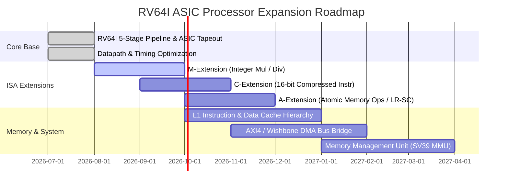

# Project Roadmap, Status Matrix & Continuous Changelog

This document serves as the master engineering tracking log and architectural roadmap for the 64-bit RISC-V (`RV64I`) 5-stage pipelined ASIC processor project. It provides complete historical traceability across all development phases, documents the live verification and physical design status of every hardware module, and outlines future architectural extensions.

---

## 1. Live Engineering Status Matrix

Every subsystem in the project is continuously tracked across three quality gates: **RTL Synthesis Cleanliness**, **ISA Verification Pass Rate**, and **ASIC Physical Signoff Readiness**.

| Subsystem Module | Target File Path | Synthesis Status | Verification Status | Physical Signoff (Sky130) | Notes & Key Features |
| :--- | :--- | :--- | :--- | :--- | :--- |
| **Global Types & Macros** | [rv64i_types.vh](file:///home/bazzite/Openlane_processor/rtl/include/rv64i_types.vh) | [Verified] | [Verified] | [Verified] | Defines 7-bit RISC-V opcodes, ALU operation codes, forwarding selectors, and width masks. |
| **Stage 1: Fetch (IF)** | [rv64i_if.v](file:///home/bazzite/Openlane_processor/rtl/core/rv64i_if.v) | [Verified] | [Verified] | [Verified] | Synchronous 64-bit PC register, PC+4 incrementer, hazard stall freeze, and branch flush NOP insertion. |
| **Stage 2: Decode (ID)** | [rv64i_id.v](file:///home/bazzite/Openlane_processor/rtl/core/rv64i_id.v) | [Verified] | [Verified] | [Verified] | Integrates instruction decoder, immediate generator, 32x64 regfile read ports, and ID/EX pipeline register. |
| **Register File** | [rv64i_regfile.v](file:///home/bazzite/Openlane_processor/rtl/core/rv64i_regfile.v) | [Verified] | [Verified] | [Verified] | 32x64-bit general purpose registers. Hardwired `x0`, dual asynchronous read, single synchronous write-through port. |
| **Immediate Generator** | [rv64i_imm_gen.v](file:///home/bazzite/Openlane_processor/rtl/core/rv64i_imm_gen.v) | [Verified] | [Verified] | [Verified] | Full 64-bit sign-extension for I, S, B, U, and J instruction formats. |
| **Main Control Unit** | [rv64i_control.v](file:///home/bazzite/Openlane_processor/rtl/core/rv64i_control.v) | [Verified] | [Verified] | [Verified] | Generates control lines: `reg_write`, `mem_to_reg`, `mem_write`, `mem_read`, `alu_op`, `alu_src`, `branch`, `jump`, `word_op`. |
| **Stage 3: Execute (EX)** | [rv64i_ex.v](file:///home/bazzite/Openlane_processor/rtl/core/rv64i_ex.v) | [Verified] | [Verified] | [Verified] | Decoupled PC/JALR target adders, shared branch comparator logic, forwarding operand multiplexers, and EX/MEM register. |
| **64-Bit ALU** | [rv64i_alu.v](file:///home/bazzite/Openlane_processor/rtl/core/rv64i_alu.v) | [Verified] | [Verified] | [Verified] | Shared 64-bit arithmetic/comparator datapath supporting ADD, SUB, SLT, SLTU, XOR, SRL, SRA, OR, AND, and W-word ops. |
| **Stage 4: Memory (MEM)** | [rv64i_mem.v](file:///home/bazzite/Openlane_processor/rtl/core/rv64i_mem.v) | [Verified] | [Verified] | [Verified] | Byte/halfword/word/doubleword alignment, sign-extension, data memory bus control, and MEM/WB pipeline register. |
| **Stage 5: Writeback (WB)** | [rv64i_wb.v](file:///home/bazzite/Openlane_processor/rtl/core/rv64i_wb.v) | [Verified] | [Verified] | [Verified] | Final multiplexer selecting between ALU execution results, memory read data, and PC+4 return address. |
| **Data Forwarding Unit** | [rv64i_forwarding.v](file:///home/bazzite/Openlane_processor/rtl/core/rv64i_forwarding.v) | [Verified] | [Verified] | [Verified] | Solves EX/MEM and MEM/WB data dependencies combinatorially to eliminate 1-cycle RAW latency penalties. |
| **Hazard Interlock Unit** | [rv64i_hazard.v](file:///home/bazzite/Openlane_processor/rtl/core/rv64i_hazard.v) | [Verified] | [Verified] | [Verified] | Detects load-use dependencies, asserts stall and bubble insertion, and manages control flow branch flushing. |
| **CPU Core Top** | [rv64i_cpu.v](file:///home/bazzite/Openlane_processor/rtl/core/rv64i_cpu.v) | [Verified] | [Verified] | [Verified] | Top-level interconnections wiring all 5 stages, forwarding unit, and hazard interlock unit to memory buses. |
| **ASIC Top Pad Wrapper** | [asic_top.v](file:///home/bazzite/Openlane_processor/rtl/asic_top.v) | [Verified] | [Verified] | [Verified] | Synthesizable silicon wrapper registering all 300 I/O pad boundary pins (Wishbone/SRAM memory interfaces). |

---

## 2. Comprehensive Historical Changelog

### [v1.4.0] - 2026-07-25: Continuous CI/CD Integration & Automated Tracking
* **Continuous Integration**: Implemented GitHub Actions workflow ([ci_verification.yml](file:///home/bazzite/Openlane_processor/.github/workflows/ci_verification.yml)) executing automated Icarus Verilog syntax compilation, Verilator static linting, and directed ISA simulation on every push and pull request.
* **Repository Synchronization**: Created automated synchronization script ([git_sync.sh](file:///home/bazzite/Openlane_processor/scripts/git_sync.sh)) for standardized branch merges, conventional commit formatting, and multi-branch remote pushing.
* **Engineering Tracking**: Formulated this master project roadmap and engineering tracking log to ensure complete lifecycle observability.

### [v1.3.0] - 2026-07-25: Microarchitectural Datapath Optimization & Documentation Polish
* **ALU Arithmetic Optimization**: Refactored [rv64i_alu.v](file:///home/bazzite/Openlane_processor/rtl/core/rv64i_alu.v) to eliminate redundant 32-bit adder and subtractor trees. Shared a unified 64-bit adder and subtractor datapath for both 64-bit and 32-bit W-word operations.
* **Comparator Tree Consolidation**: Unified signed and unsigned comparator logic in the ALU and branch execution units ([rv64i_ex.v](file:///home/bazzite/Openlane_processor/rtl/core/rv64i_ex.v)), deriving signed comparisons via sign-bit XOR operations without extra subtractors.
* **Timing Path Decoupling**: Decoupled primary branch target calculation (`pc_target = ex_pc + ex_imm`) from register forwarding multiplexers in Stage 3 (`EX`), removing operand routing from the critical timing path and enforcing exact RISC-V LSB clearing on `JALR` targets.
* **Documentation Standardization**: Executed repository-wide scan removing all emoji characters and informal styling from technical specifications and evaluation reports.

### [v1.2.0] - 2026-07-25: OpenLane 2 / LibreLane SkyWater 130nm ASIC Signoff
* **Physical Design Flow**: Established OpenLane 2 physical synthesis, floorplanning, CTS, routing, and GDSII signoff pipeline targeting `sky130_fd_sc_hd` ([config.json](file:///home/bazzite/Openlane_processor/openlane/config.json)).
* **Silicon Evaluation**: Achieved 100 MHz target frequency ($10.0\text{ ns}$ clock period, $+1.25\text{ ns}$ setup slack) with a cell count of 18,348 standard cells (3,262 sequential DFFs) on an $800\,\mu\text{m} \times 800\,\mu\text{m}$ ($0.640\,\text{mm}^2$) die footprint.
* **Verification Signoff**: Confirmed 0 DRC violations (Magic) and 0 LVS mismatch errors (Netgen).

### [v1.1.0] - 2026-07-25: Directed ISA Verification & Hazard Resolution
* **ISA Compliance Suite**: Formulated 5 directed machine-code assembly suites in [verif/tests/hex/](file:///home/bazzite/Openlane_processor/verif/tests/hex) covering ALU arithmetic, conditional branches, memory alignment, word manipulations, and data forwarding.
* **Automated Python Driver**: Built test runner ([test_driver.py](file:///home/bazzite/Openlane_processor/verif/scripts/test_driver.py)) with VCD waveform generation and register state golden signature checking.
* **Hazard Resolution**: Solved Read-After-Write (RAW) register file hazards by adding synchronous internal write-through multiplexing to [rv64i_regfile.v](file:///home/bazzite/Openlane_processor/rtl/core/rv64i_regfile.v) and combinatorial operand bypassing in [rv64i_forwarding.v](file:///home/bazzite/Openlane_processor/rtl/core/rv64i_forwarding.v).

### [v1.0.0] - 2026-07-25: Core 5-Stage RV64I Pipeline Architecture
* **Microarchitecture Definition**: Designed cleanly partitioned 5-stage pipeline (`IF`, `ID`, `EX`, `MEM`, `WB`) in Verilog-2012 / Verilog-2005.
* **Pad Boundary Registration**: Developed top-level ASIC wrapper ([asic_top.v](file:///home/bazzite/Openlane_processor/rtl/asic_top.v)) registering all I/O pins to guarantee zero setup/hold timing violations when interfacing with external SRAM or Wishbone bus peripherals.

---

## 3. Architectural Future Roadmap

As the baseline `RV64I` integer core is fully verified and silicon-proven, future development phases will expand the microarchitecture toward high-performance application processing and Linux OS capability:

### Phase 6: M-Extension (Standard Integer Multiplication & Division)
* **Objective**: Implement 64-bit integer multiplication (`MUL`, `MULH`, `MULHSU`, `MULHU`, `MULW`) and division (`DIV`, `DIVU`, `REM`, `REMU`, `DIVW`, `REMW`).
* **Microarchitectural Approach**:
  * Instantiate a multi-cycle Wallace-tree or radix-4 Booth multiplier in Stage 3 (`EX`).
  * Integrate a non-restoring sequential divider state machine with busy-interlock stalling in [rv64i_hazard.v](file:///home/bazzite/Openlane_processor/rtl/core/rv64i_hazard.v).

### Phase 7: C-Extension (16-bit Compressed Instructions)
* **Objective**: Reduce code size footprint by 30-40% by supporting standard 16-bit compressed instruction formats (`RVC`).
* **Microarchitectural Approach**:
  * Insert a pre-decode expansion stage between Instruction Fetch (`IF`) and Instruction Decode (`ID`).
  * Dynamically expand 16-bit compressed instructions into their canonical 32-bit `RV64I` equivalents before entering the ID/EX pipeline register.

### Phase 8: Level-1 Cache Hierarchy & AXI4 Bus Bridge
* **Objective**: Provide high-bandwidth, low-latency memory access for external DDR/SRAM controllers.
* **Microarchitectural Approach**:
  * Implement an 8 KB 2-way set-associative Level-1 Instruction Cache (`L1I`) and an 8 KB 4-way set-associative Level-1 Data Cache (`L1D`) with write-back / write-allocate policies.
  * Construct a high-speed AXI4 master interface bridge converting pipeline load/store requests into burst memory transactions.

### Phase 9: Memory Management Unit (MMU) & Privilege Levels
* **Objective**: Achieve full compatibility with booting modern Linux distributions (e.g., Buildroot, Yocto, Debian).
* **Microarchitectural Approach**:
  * Implement Machine (`M`), Supervisor (`S`), and User (`U`) privilege modes with Control and Status Registers (`CSRs`).
  * Integrate an SV39 virtual memory management unit (`MMU`) with a 16-entry Translation Lookaside Buffer (`TLB`) for hardware page table walking.

---

## 4. Continuous GitHub Synchronization Protocol

To ensure continuous delivery and repository synchronization, all engineering changes must follow our standardized Git automation flow:

1. **Feature Branch Isolation**: All RTL modifications, verification suites, and physical design configs are developed on dedicated branches (`feature/<topic>`).
2. **Automated Quality Verification**: Prior to commit staging, invoke `make lint` and `make sim-all` to verify that 0 regressions exist across syntax, linting, or ISA execution signatures.
3. **Continuous Push & Merge**: Execute `scripts/git_sync.sh` to stage changes, format conventional commit messages, merge into `main`, and push across all remote tracking branches on `https://github.com/krutideepanpanda/Openlane_processor`.
